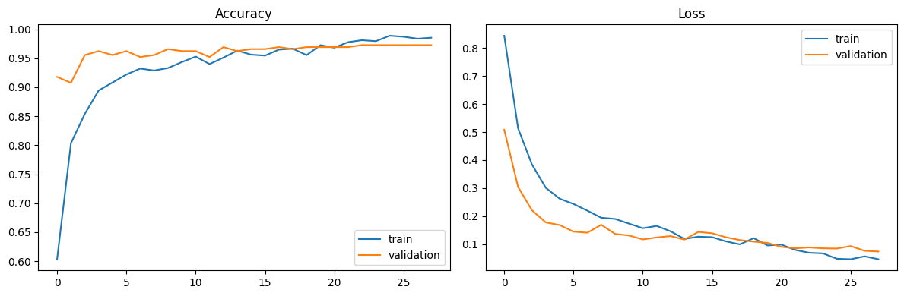
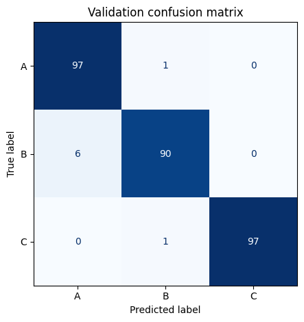

# ABC Hands — Image Classification with EfficientNetB0

An end-to-end computer vision project that classifies hand-sign images into three classes: **A**, **B**, and **C**.

## Results

| Evaluation | Accuracy | Macro F1 |
|---|---:|---:|
| Stratified validation split (20%, 292 images) | **97.26%** | **97.25%** |
| Hidden external test | **94.95%** | Not provided |

The 2.31-point gap between local validation and the hidden test indicates good generalization. The validation result comes from a **single image-level split**, not cross-validation; the hidden test is therefore the strongest external result.

### Training curves



### Validation confusion matrix



## Dataset

- **1,457 private images** from **22 participants**
- Three balanced classes: A, B, and C
- Participant images are excluded from this public repository for privacy

Expected local structure:

```text
grouped/
├── Participant_01/
│   ├── A/
│   ├── B/
│   └── C/
└── Participant_02/
    └── ...
```

## Method

- EXIF correction and RGB conversion
- Aspect-ratio-preserving padding to 224 × 224 with `ImageOps.pad`
- EfficientNetB0 initialized with ImageNet weights
- Augmentation with rotation, zoom, brightness, and contrast—without horizontal flipping
- Dense(32), ReLU, and Dropout(0.50) classification head
- AdamW optimization and two-stage transfer learning
- Fine-tuning of the final 60 backbone layers while Batch Normalization stays frozen
- Final continuation on all labelled images and native `.keras` export

## Repository structure

```text
ABC-Hands-Classification/
├── notebooks/
│   └── ABC_Hands_project_EfficientNetB0.ipynb
├── reports/
│   ├── training_curves.png
│   └── validation_confusion_matrix.png
├── models/
│   └── README.md
├── .gitignore
├── LICENSE
├── README.md
└── requirements.txt
```

## Run in Google Colab

1. Open the notebook in Colab and select a GPU runtime.
2. Put the private dataset in `/content/drive/MyDrive/grouped`, or change `DATA_DIR`.
3. Run the notebook from top to bottom.
4. The model and metadata are written to `ABC_case_study/final_submission` in Drive.

The notebook saved and successfully reloaded a model accepting `(224, 224, 3)` RGB images and returning probabilities for the three classes.

## Privacy and reproducibility

The public repository deliberately excludes participant images, trained model weights, Drive outputs, and hidden-test material. The executed notebook retains the aggregate metrics and plots but removes embedded participant previews and participant-level tables.

## License

The code is available under the MIT License. The private dataset is not covered by this license.
